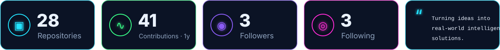
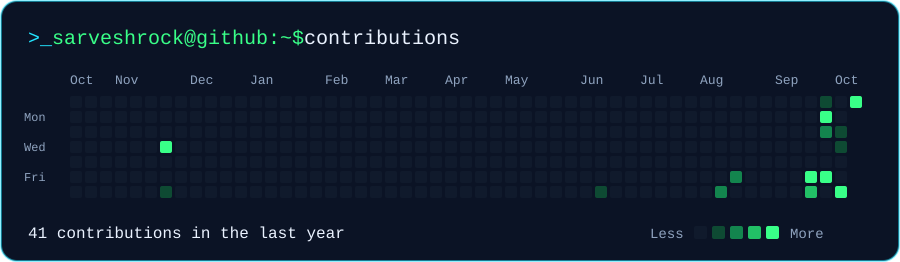
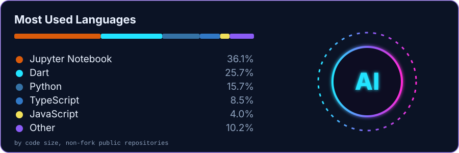

  

 

 

 

Resume projects are not published as public repositories, so they carry no links. Only UnmaskAI is a public repo.

<table>
<tr><td width="50%"></td><td width="50%"></td></tr>
<tr><td width="50%"></td><td width="50%"></td></tr>
<tr><td width="50%"></td><td width="50%"></td></tr>
<tr><td width="50%"></td><td width="50%"></td></tr>
</table>

 

B.Tech Computer Engineering, MIT World Peace University, Pune · 2021–2025 · GPA 8.49/10

 

 

 

