


**AI/ML Engineer · Python Automation & AI Platform Developer @ Infosys**
Computer Vision · Generative AI · LLMs · Agentic AI · Real-time inference

<!-- TODO: uncomment and add your real URLs (no placeholders published)

-->

 



> End-to-end production ML systems: scalable pipelines, model optimization and quantization, low-latency inference, and real-time AI agents.
> B.Tech Computer Engineering, MIT World Peace University, Pune (2021–2025), GPA 8.49/10.

 


 


  

 


 



Also: C++ · Java · A/B Testing · Feature Engineering · Albumentations

 


 


Resume projects below are not published as public repositories.


### Public repositories

<a href="https://github.com/Sarveshrock/AURA"></a>
<a href="https://github.com/Sarveshrock/AI-Contract"></a>
<a href="https://github.com/Sarveshrock/UnmaskAI"></a>

 


 



 



 


  


